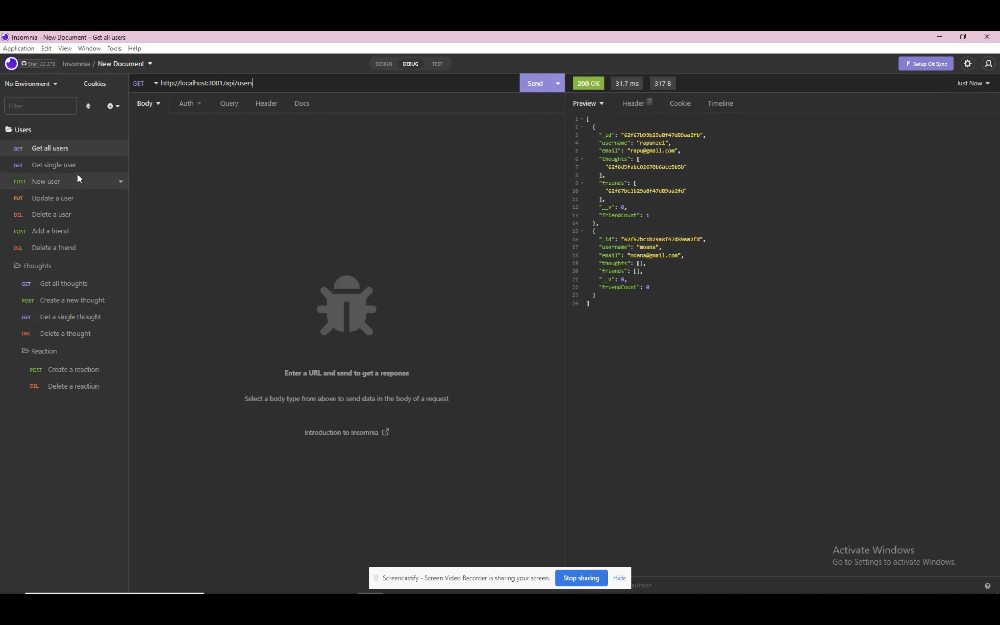
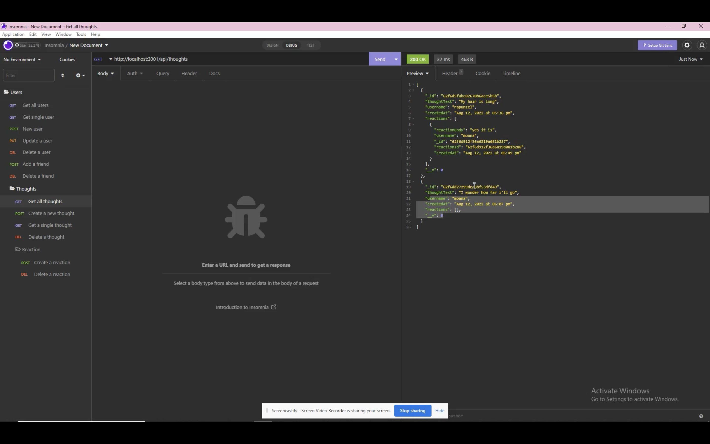
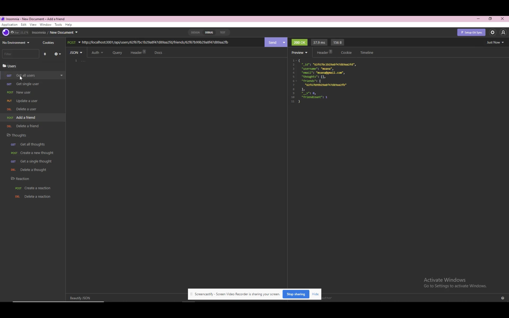

# Social-Network-API

# Description

This is a social network api. Users can share thoughts, give reactions to peoples thought, be able to have friends.

# Preview

Get all the users

Get all the thoughts

Add a friend

# Instructions

API that uses MongoDB which allows the website to handle large amounts of unstructured data. 

1). after you clone the application. you will open the terminal and run `npm i` to download all the dependecies

2). In order to use the api social network, I used insomnia.

3). refer to the demo above to use the application

4). You're able to Get all users, Get a single user, create a new user, update a user, delete a user. for the user functionality of it.

5). You're able to get all thoughts, create a new thought, get a single thought, and delete a thought.

6). You're able to add a friend, and delete a friend. As well as react to a thought and delete a reaction.

# Technologies

- Javascript

- Node.js

- Express.js

- MongoDB

- Mongoose

- Insomnia

- Moment.js

- Nodemon

# Routes

Get all users: GET /api/users

Get a single user by its id: GET /api/users/:userId

Update a user by its id: PUT /api/users/:userId

Delete a user by its id: DELETE /api/user/:userId

Add a new friend to a user's friend list: POST /api/users/:userid/friends/:friendId

Delete a friend from a user's friend list: DELETE /api/users/:userid/friends/:friendId

Create a new thought: POST /api/thoughts/

Get all thoughts: GET /api/thoughts/

Get a single thought by its id: GET /api/thoughts/:thoughtId

Update a thought by its id: PUT /api/thoughts/:thoughtId

Delete a thought by its id: DELETE /api/thoughts/:thoughtId

Create a reaction: POST /api/thoughts/:thoughtId/reactions

Delete a reaction by the reactionId: DEL /api/thoughts/:thoughtId/reactions/:reactionId

# Question

If you have any questions please feel free to contact me 

[Github](https://github.com/Drewpayton)

[Linkedin](https://www.linkedin.com/in/drewpayton2018/)

[drewpayton18@gmail.com](drewpayton18@gmail.com)